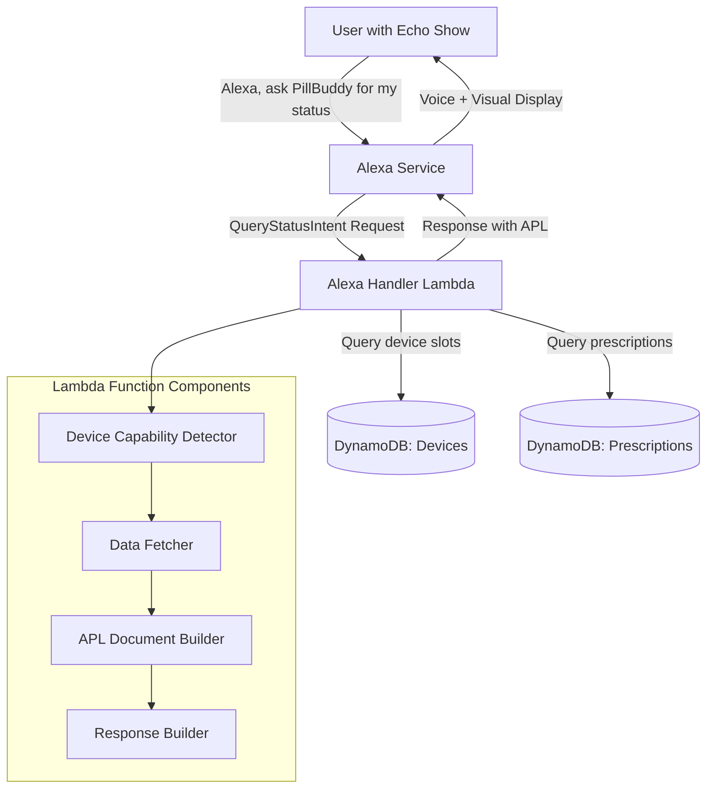

# Design Document: Alexa APL Visual Display

## Overview

This feature adds visual display support to the PillBuddy Alexa skill using Alexa Presentation Language (APL) 1.6. When users with Echo Show devices query their pill status, they will receive both a voice response and a visual display showing their three pill bottle slots, prescription names, pill counts, and low-pill warnings.

The implementation extends the existing `handle_query_status_intent()` function in the Alexa Lambda handler to:

1. Detect device APL capabilities
2. Fetch data from both DynamoDB tables (Prescriptions and Devices)
3. Construct an APL document with slot data
4. Return a response containing both voice output and APL directives

The design maintains backward compatibility with non-visual Alexa devices (Echo Dot, Echo, etc.) by conditionally including APL directives only when the device supports them.

## Architecture

### High-Level Component Diagram

