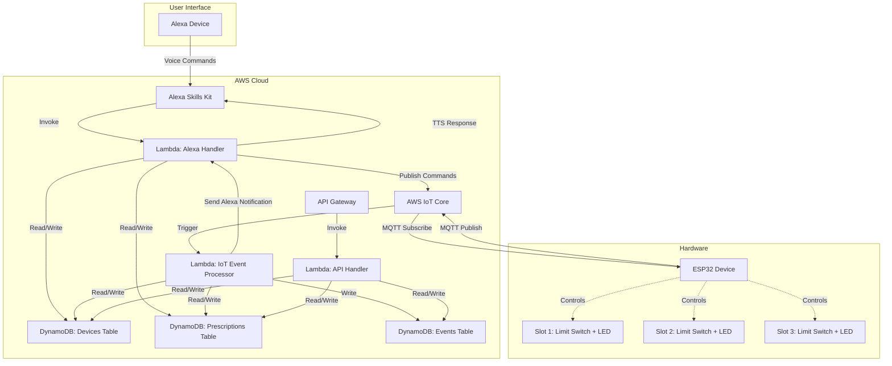
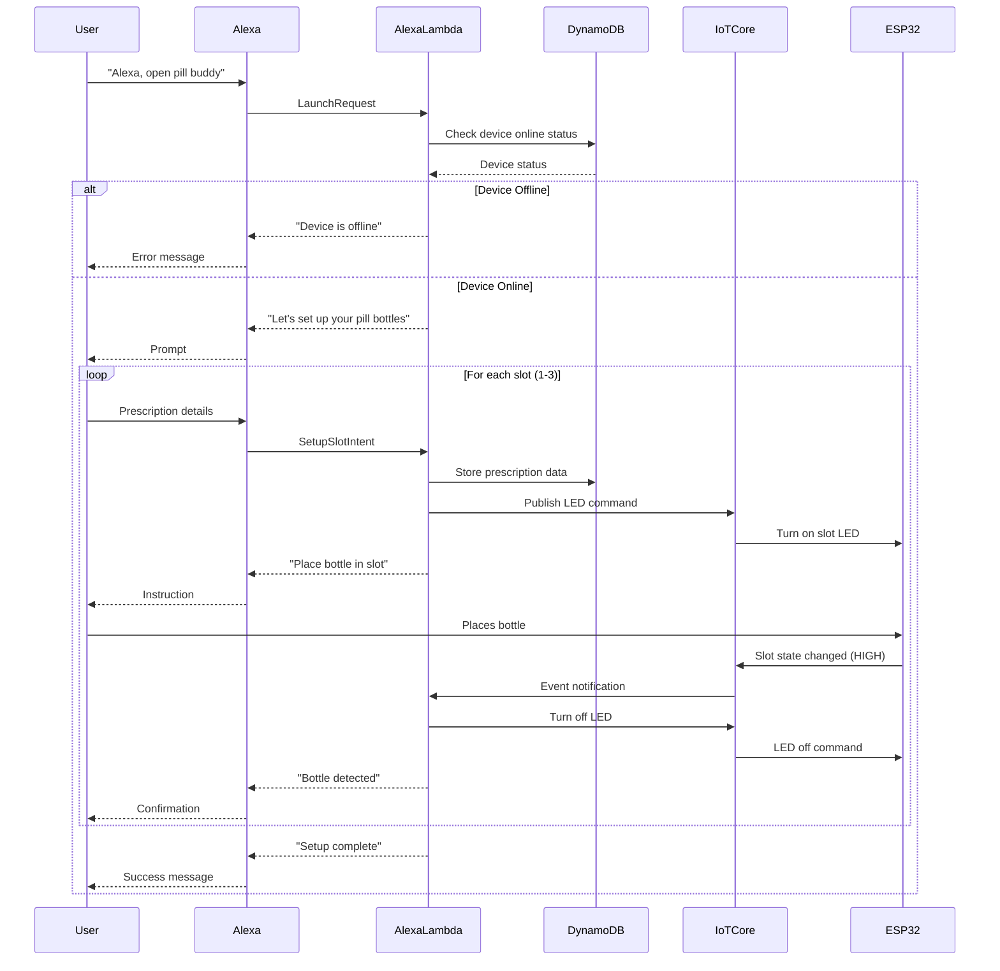
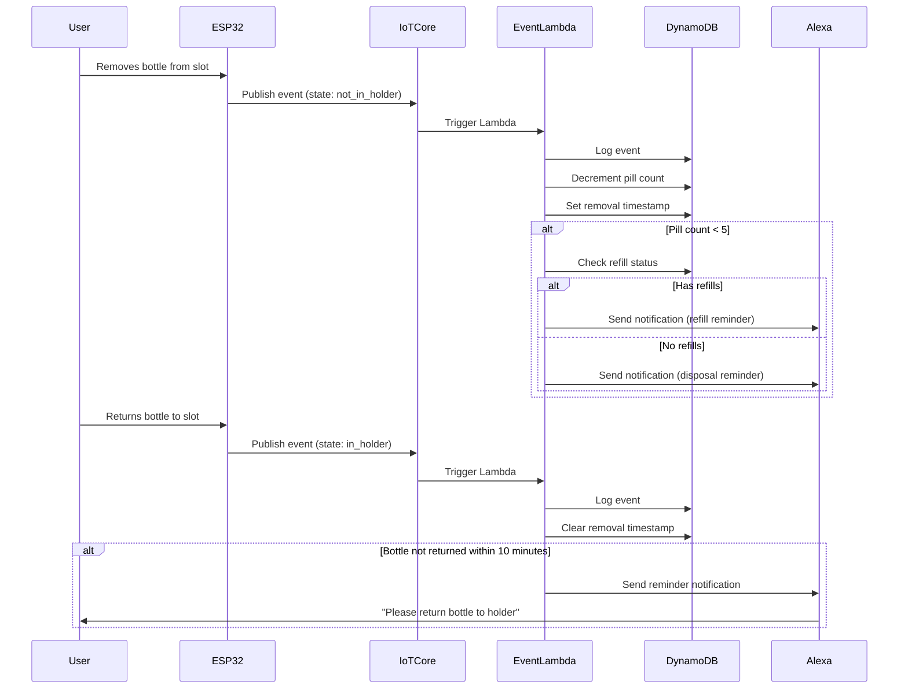

# Design Document: PillBuddy Backend Alexa Integration

## Overview

PillBuddy is a smart pill bottle holder system for senior citizens that combines ESP32 hardware with AWS cloud services and Alexa voice interaction. The system tracks pill bottles across 3 slots using limit switches, monitors pill consumption, manages refill reminders, and provides LED guidance for users. This hackathon-focused design prioritizes rapid prototyping with no authentication or formal testing requirements.

The backend orchestrates communication between ESP32 devices (via AWS IoT Core), stores prescription data (DynamoDB), and handles Alexa voice interactions (Alexa Skills Kit + Lambda). Key workflows include initial setup via voice commands, real-time pill removal detection, automatic pill count tracking with refill reminders, and LED control for user guidance.

## Architecture



## Main Workflows

### Workflow 1: Initial Setup via Alexa



### Workflow 2: Pill Removal Detection and Tracking



## Components and Interfaces

### Component 1: Alexa Skill Handler (Lambda)

**Purpose**: Processes Alexa voice commands and manages conversational flow for setup and queries

**Interface**:

```python
def lambda_handler(event, context):
    """
    Main entry point for Alexa Skill requests

    Args:
        event: Alexa request (LaunchRequest, IntentRequest, SessionEndedRequest)
        context: Lambda context object

    Returns:
        Alexa response with speech output and session attributes
    """
    pass

def handle_launch_request(device_id):
    """Check device status and start setup flow"""
    pass

def handle_setup_slot_intent(device_id, slot, prescription_name, pill_count, has_refills):
    """Store prescription data and trigger LED"""
    pass

def handle_query_status_intent(device_id):
    """Return current status of all slots"""
    pass

def publish_iot_command(device_id, action, slot):
    """Publish command to IoT Core topic"""
    pass
```

**Responsibilities**:

- Parse Alexa requests and route to appropriate handlers
- Manage multi-turn conversation state for setup flow
- Query and update DynamoDB tables
- Publish LED control commands to IoT Core
- Format speech responses for Alexa TTS

### Component 2: IoT Event Processor (Lambda)

**Purpose**: Processes ESP32 events from IoT Core and updates system state

**Interface**:

```python
def lambda_handler(event, context):
    """
    Process IoT Core events from ESP32 devices

    Args:
        event: IoT message from pillbuddy/events/<device_id>
        context: Lambda context object

    Returns:
        Processing status
    """
    pass

def handle_slot_state_changed(device_id, slot, in_holder, timestamp, sequence):
    """Process slot state change event"""
    pass

def decrement_pill_count(device_id, slot):
    """Decrease pill count and check thresholds"""
    pass

def check_refill_reminder(device_id, slot, pill_count, has_refills):
    """Send Alexa notification if refill needed"""
    pass

def check_bottle_return_timeout(device_id, slot, removal_timestamp):
    """Send reminder if bottle not returned within 10 minutes"""
    pass

def send_alexa_notification(device_id, message):
    """Send proactive notification to user's Alexa device"""
    pass
```

**Responsibilities**:

- Parse IoT Core MQTT messages from ESP32
- Log all events to Events table
- Update prescription pill counts
- Trigger refill/disposal reminders based on thresholds
- Monitor bottle return timeouts
- Send proactive Alexa notifications

### Component 3: API Handler (Lambda)

**Purpose**: Provides REST API for device management and data queries (optional for hackathon)

**Interface**:

```python
def lambda_handler(event, context):
    """
    Handle API Gateway requests

    Args:
        event: API Gateway proxy event
        context: Lambda context object

    Returns:
        API Gateway response with status code and body
    """
    pass

def get_device_status(device_id):
    """GET /devices/{device_id}/status"""
    pass

def get_prescriptions(device_id):
    """GET /devices/{device_id}/prescriptions"""
    pass

def get_events(device_id, start_time, end_time):
    """GET /devices/{device_id}/events"""
    pass

def update_prescription(device_id, slot, updates):
    """PATCH /devices/{device_id}/slots/{slot}"""
    pass
```

**Responsibilities**:

- Provide HTTP REST interface for device data
- Query DynamoDB tables
- Return JSON responses
- Handle CORS for web dashboard (if needed)

## Data Models

### Model 1: Device

**Table**: Devices

```python
{
    "device_id": "string",  # Partition key (ESP32 unique identifier)
    "online": "boolean",    # Device connection status
    "last_seen": "number",  # Unix timestamp (milliseconds)
    "created_at": "number", # Unix timestamp (milliseconds)
    "slots": {
        "1": {
            "in_holder": "boolean",
            "last_state_change": "number"  # Unix timestamp
        },
        "2": {
            "in_holder": "boolean",
            "last_state_change": "number"
        },
        "3": {
            "in_holder": "boolean",
            "last_state_change": "number"
        }
    }
}
```

**Validation Rules**:

- device_id must be non-empty string
- slots object must contain keys "1", "2", "3" only
- in_holder must be boolean
- Timestamps must be positive integers

### Model 2: Prescription

**Table**: Prescriptions

```python
{
    "device_id": "string",        # Partition key
    "slot": "number",             # Sort key (1, 2, or 3)
    "prescription_name": "string",
    "pill_count": "number",       # Current count
    "initial_count": "number",    # Starting count
    "has_refills": "boolean",
    "created_at": "number",       # Unix timestamp
    "updated_at": "number",       # Unix timestamp
    "removal_timestamp": "number" # Unix timestamp when bottle removed (null if in holder)
}
```

**Validation Rules**:

- device_id must be non-empty string
- slot must be 1, 2, or 3
- prescription_name must be non-empty string
- pill_count must be non-negative integer
- initial_count must be positive integer
- has_refills must be boolean
- removal_timestamp is null when bottle in holder

### Model 3: Event

**Table**: Events

```python
{
    "device_id": "string",     # Partition key
    "timestamp": "number",     # Sort key (Unix timestamp milliseconds)
    "event_type": "string",    # "slot_state_changed"
    "slot": "number",          # 1, 2, or 3
    "state": "string",         # "in_holder" or "not_in_holder"
    "in_holder": "boolean",
    "sensor_level": "number",  # 0 (LOW) or 1 (HIGH)
    "sequence": "number",      # ESP32 sequence number
    "ttl": "number"            # DynamoDB TTL (auto-delete after 30 days)
}
```

**Validation Rules**:

- device_id must be non-empty string
- timestamp must be positive integer
- event_type must be "slot_state_changed"
- slot must be 1, 2, or 3
- state must be "in_holder" or "not_in_holder"
- sensor_level must be 0 or 1
- ttl set to timestamp + 30 days for auto-cleanup

## Algorithmic Pseudocode

### Algorithm 1: Process Setup Slot Intent

```pascal
ALGORITHM processSetupSlotIntent(deviceId, slot, prescriptionName, pillCount, hasRefills)
INPUT: deviceId (string), slot (integer 1-3), prescriptionName (string),
       pillCount (integer), hasRefills (boolean)
OUTPUT: AlexaResponse with speech and session state

BEGIN
  ASSERT deviceId ≠ ∅ AND slot ∈ {1, 2, 3}
  ASSERT prescriptionName ≠ ∅ AND pillCount > 0

  // Store prescription in database
  prescription ← {
    device_id: deviceId,
    slot: slot,
    prescription_name: prescriptionName,
    pill_count: pillCount,
    initial_count: pillCount,
    has_refills: hasRefills,
    created_at: currentTimestamp(),
    updated_at: currentTimestamp(),
    removal_timestamp: null
  }

  result ← dynamoDB.putItem("Prescriptions", prescription)

  IF result.success = false THEN
    RETURN AlexaResponse("Sorry, I couldn't save that prescription. Please try again.")
  END IF

  // Turn on LED to guide user
  command ← {
    action: "turn_on",
    slot: slot
  }

  iotCore.publish("pillbuddy/cmd/" + deviceId, command)

  // Update session state
  sessionState ← getSessionAttribute("setup_state")
  sessionState.slots_configured ← sessionState.slots_configured + 1

  IF sessionState.slots_configured < 3 THEN
    speech ← "Great! I've saved " + prescriptionName +
             ". The LED is on. Please place the bottle in slot " + slot +
             ". Would you like to set up another bottle?"
    shouldEndSession ← false
  ELSE
    speech ← "Perfect! All three slots are configured. Your PillBuddy is ready to use."
    shouldEndSession ← true
  END IF

  RETURN AlexaResponse(speech, sessionState, shouldEndSession)

  ASSERT result.success = true
END
```

**Preconditions**:

- deviceId exists in Devices table
- slot is valid (1, 2, or 3)
- prescriptionName is non-empty
- pillCount is positive integer

**Postconditions**:

- Prescription record created in DynamoDB
- LED command published to IoT Core
- Session state updated with slot count
- Alexa response contains appropriate speech

**Loop Invariants**: N/A (no loops in this algorithm)

### Algorithm 2: Process Slot State Changed Event

```pascal
ALGORITHM processSlotStateChanged(deviceId, slot, inHolder, timestamp, sequence)
INPUT: deviceId (string), slot (integer 1-3), inHolder (boolean),
       timestamp (integer), sequence (integer)
OUTPUT: Processing status and side effects (notifications, DB updates)

BEGIN
  ASSERT deviceId ≠ ∅ AND slot ∈ {1, 2, 3}
  ASSERT timestamp > 0 AND sequence ≥ 0

  // Log event to Events table
  event ← {
    device_id: deviceId,
    timestamp: timestamp,
    event_type: "slot_state_changed",
    slot: slot,
    state: inHolder ? "in_holder" : "not_in_holder",
    in_holder: inHolder,
    sensor_level: inHolder ? 1 : 0,
    sequence: sequence,
    ttl: timestamp + (30 * 24 * 60 * 60 * 1000)  // 30 days
  }

  dynamoDB.putItem("Events", event)

  // Update device slot state
  deviceUpdate ← {
    device_id: deviceId,
    slots: {
      [slot]: {
        in_holder: inHolder,
        last_state_change: timestamp
      }
    },
    last_seen: timestamp
  }

  dynamoDB.updateItem("Devices", deviceUpdate)

  // Get prescription for this slot
  prescription ← dynamoDB.getItem("Prescriptions", {
    device_id: deviceId,
    slot: slot
  })

  IF prescription = null THEN
    RETURN {status: "success", message: "No prescription configured"}
  END IF

  IF inHolder = false THEN
    // Bottle removed - decrement pill count
    newCount ← prescription.pill_count - 1

    IF newCount < 0 THEN
      newCount ← 0
    END IF

    prescriptionUpdate ← {
      pill_count: newCount,
      removal_timestamp: timestamp,
      updated_at: timestamp
    }

    dynamoDB.updateItem("Prescriptions", prescriptionUpdate)

    // Check if refill reminder needed
    IF newCount < 5 THEN
      IF prescription.has_refills = true THEN
        message ← "Your " + prescription.prescription_name +
                  " is running low with " + newCount +
                  " pills remaining. Please get a refill soon."
      ELSE
        message ← "Your " + prescription.prescription_name +
                  " is running low with " + newCount +
                  " pills remaining. Please dispose of the empty bottle."
      END IF

      sendAlexaNotification(deviceId, message)
    END IF

    // Schedule timeout check for bottle return
    scheduleTimeoutCheck(deviceId, slot, timestamp, 10 * 60 * 1000)  // 10 minutes

  ELSE
    // Bottle returned - clear removal timestamp and turn off LED
    prescriptionUpdate ← {
      removal_timestamp: null,
      updated_at: timestamp
    }

    dynamoDB.updateItem("Prescriptions", prescriptionUpdate)

    // Turn off LED
    command ← {
      action: "turn_off",
      slot: slot
    }

    iotCore.publish("pillbuddy/cmd/" + deviceId, command)

    // Cancel timeout check
    cancelTimeoutCheck(deviceId, slot)
  END IF

  RETURN {status: "success", message: "Event processed"}

  ASSERT event logged AND device state updated
END
```

**Preconditions**:

- deviceId exists in Devices table
- slot is valid (1, 2, or 3)
- timestamp is valid Unix timestamp in milliseconds
- sequence number is non-negative

**Postconditions**:

- Event logged to Events table with TTL
- Device slot state updated in Devices table
- If bottle removed: pill count decremented, removal timestamp set
- If bottle returned: removal timestamp cleared, LED turned off
- Refill notification sent if pill count < 5
- Timeout check scheduled/cancelled appropriately

**Loop Invariants**: N/A (no loops in this algorithm)

### Algorithm 3: Check Bottle Return Timeout

```pascal
ALGORITHM checkBottleReturnTimeout(deviceId, slot, removalTimestamp)
INPUT: deviceId (string), slot (integer 1-3), removalTimestamp (integer)
OUTPUT: Notification sent if timeout exceeded

BEGIN
  ASSERT deviceId ≠ ∅ AND slot ∈ {1, 2, 3}
  ASSERT removalTimestamp > 0

  currentTime ← currentTimestamp()
  timeoutThreshold ← 10 * 60 * 1000  // 10 minutes in milliseconds

  // Get current prescription state
  prescription ← dynamoDB.getItem("Prescriptions", {
    device_id: deviceId,
    slot: slot
  })

  IF prescription = null THEN
    RETURN {status: "no_prescription"}
  END IF

  // Check if bottle is still out
  IF prescription.removal_timestamp ≠ null THEN
    elapsedTime ← currentTime - prescription.removal_timestamp

    IF elapsedTime ≥ timeoutThreshold THEN
      message ← "Reminder: Please return your " +
                prescription.prescription_name +
                " bottle to slot " + slot + " of your PillBuddy."

      sendAlexaNotification(deviceId, message)

      RETURN {status: "notification_sent", elapsed: elapsedTime}
    ELSE
      RETURN {status: "within_timeout", elapsed: elapsedTime}
    END IF
  ELSE
    // Bottle already returned
    RETURN {status: "bottle_returned"}
  END IF

  ASSERT notification sent only if timeout exceeded AND bottle still out
END
```

**Preconditions**:

- deviceId exists in Devices table
- slot is valid (1, 2, or 3)
- removalTimestamp is valid Unix timestamp

**Postconditions**:

- If timeout exceeded and bottle still out: notification sent
- If bottle returned: no notification sent
- Status returned indicating action taken

**Loop Invariants**: N/A (no loops in this algorithm)

## Alexa Skill Configuration

### Skill Invocation

**Invocation Name**: `pill buddy` (two words required by Alexa)

**Sample Utterances**:

- "Alexa, open pill buddy"
- "Alexa, ask pill buddy about my pills"
- "Alexa, tell pill buddy to set up my bottles"

### Intents

#### 1. LaunchRequest (Built-in)

**Purpose**: Handle skill launch and check device status

**Response Flow**:

- Check if device is online
- If online: Start setup flow or provide status
- If offline: Inform user device is not connected

#### 2. SetupSlotIntent

**Purpose**: Configure a prescription for a specific slot

**Slots**:

- `prescriptionName` (AMAZON.MedicationName or custom slot)
- `pillCount` (AMAZON.NUMBER)
- `hasRefills` (AMAZON.YesNo converted to boolean)

**Sample Utterances**:

- "The prescription is {prescriptionName} with {pillCount} pills"
- "{prescriptionName} has {pillCount} pills and {hasRefills} refills"
- "Set up {prescriptionName}"

**Dialog Model**: Multi-turn conversation to collect all required slots

#### 3. QueryStatusIntent

**Purpose**: Get current status of all slots

**Slots**: None

**Sample Utterances**:

- "What's my status"
- "How many pills do I have"
- "Check my bottles"
- "What's in my PillBuddy"

**Response**: List each slot with prescription name and pill count

#### 4. AMAZON.HelpIntent (Built-in)

**Response**: "PillBuddy helps you track your pill bottles. You can set up bottles, check your pill counts, and get refill reminders. What would you like to do?"

#### 5. AMAZON.StopIntent (Built-in)

**Response**: "Goodbye!"

#### 6. AMAZON.CancelIntent (Built-in)

**Response**: "Okay, cancelled."

### Proactive Notifications

**Events API**: Enable proactive events for refill reminders

**Notification Types**:

- Refill reminder (pill count < 5, has refills)
- Disposal reminder (pill count < 5, no refills)
- Bottle return reminder (bottle out > 10 minutes)

**Permission Required**: `alexa::devices:all:notifications:write`

## AWS IoT Core Configuration

### MQTT Topics

#### 1. Device Events Topic

**Topic**: `pillbuddy/events/{device_id}`

**Direction**: ESP32 → AWS IoT Core

**Message Format**:

```json
{
  "event_type": "slot_state_changed",
  "slot": 2,
  "state": "not_in_holder",
  "in_holder": false,
  "sensor_level": 0,
  "ts_ms": 1700000000000,
  "sequence": 120
}
```

**IoT Rule**: Forward to Lambda (IoT Event Processor)

**Rule SQL**:

```sql
SELECT * FROM 'pillbuddy/events/+'
```

#### 2. Device Commands Topic

**Topic**: `pillbuddy/cmd/{device_id}`

**Direction**: AWS IoT Core → ESP32

**Message Format**:

```json
{
  "action": "turn_on",
  "slot": 2
}
```

**Actions**:

- `turn_on`: Turn on LED for specified slot
- `turn_off`: Turn off LED for specified slot

### IoT Thing Configuration

**Thing Name**: `pillbuddy_{device_id}`

**Thing Type**: `PillBuddyDevice`

**Attributes**:

- `device_id`: Unique identifier
- `firmware_version`: ESP32 firmware version
- `hardware_version`: Hardware revision

**Shadow**: Not required for hackathon (using direct MQTT)

### IoT Policy

**Policy Name**: `PillBuddyDevicePolicy`

**Policy Document**:

```json
{
  "Version": "2012-10-17",
  "Statement": [
    {
      "Effect": "Allow",
      "Action": "iot:Connect",
      "Resource": "arn:aws:iot:REGION:ACCOUNT:client/pillbuddy_*"
    },
    {
      "Effect": "Allow",
      "Action": "iot:Publish",
      "Resource": "arn:aws:iot:REGION:ACCOUNT:topic/pillbuddy/events/*"
    },
    {
      "Effect": "Allow",
      "Action": "iot:Subscribe",
      "Resource": "arn:aws:iot:REGION:ACCOUNT:topicfilter/pillbuddy/cmd/*"
    },
    {
      "Effect": "Allow",
      "Action": "iot:Receive",
      "Resource": "arn:aws:iot:REGION:ACCOUNT:topic/pillbuddy/cmd/*"
    }
  ]
}
```

## DynamoDB Table Specifications

### Table 1: Devices

**Table Name**: `PillBuddy_Devices`

**Primary Key**:

- Partition Key: `device_id` (String)

**Attributes**:

- `device_id` (S): Unique device identifier
- `online` (BOOL): Connection status
- `last_seen` (N): Unix timestamp in milliseconds
- `created_at` (N): Unix timestamp in milliseconds
- `slots` (M): Map of slot states
  - `1` (M): Slot 1 state
    - `in_holder` (BOOL)
    - `last_state_change` (N)
  - `2` (M): Slot 2 state
  - `3` (M): Slot 3 state

**Provisioned Capacity** (Hackathon):

- Read: 5 RCU
- Write: 5 WCU

**GSI**: None required

### Table 2: Prescriptions

**Table Name**: `PillBuddy_Prescriptions`

**Primary Key**:

- Partition Key: `device_id` (String)
- Sort Key: `slot` (Number)

**Attributes**:

- `device_id` (S): Device identifier
- `slot` (N): Slot number (1, 2, or 3)
- `prescription_name` (S): Medication name
- `pill_count` (N): Current pill count
- `initial_count` (N): Starting pill count
- `has_refills` (BOOL): Refill availability
- `created_at` (N): Unix timestamp
- `updated_at` (N): Unix timestamp
- `removal_timestamp` (N): When bottle was removed (null if in holder)

**Provisioned Capacity** (Hackathon):

- Read: 5 RCU
- Write: 5 WCU

**GSI**: None required

### Table 3: Events

**Table Name**: `PillBuddy_Events`

**Primary Key**:

- Partition Key: `device_id` (String)
- Sort Key: `timestamp` (Number)

**Attributes**:

- `device_id` (S): Device identifier
- `timestamp` (N): Unix timestamp in milliseconds
- `event_type` (S): Event type ("slot_state_changed")
- `slot` (N): Slot number
- `state` (S): "in_holder" or "not_in_holder"
- `in_holder` (BOOL): Boolean state
- `sensor_level` (N): 0 or 1
- `sequence` (N): ESP32 sequence number
- `ttl` (N): DynamoDB TTL for auto-deletion

**Provisioned Capacity** (Hackathon):

- Read: 5 RCU
- Write: 10 WCU (higher for event logging)

**TTL**: Enabled on `ttl` attribute (auto-delete after 30 days)

**GSI**: None required for hackathon

## Lambda Function Specifications

### Lambda 1: Alexa Skill Handler

**Function Name**: `PillBuddy_AlexaHandler`

**Runtime**: Python 3.11

**Memory**: 256 MB

**Timeout**: 10 seconds

**Environment Variables**:

- `DEVICES_TABLE`: PillBuddy_Devices
- `PRESCRIPTIONS_TABLE`: PillBuddy_Prescriptions
- `IOT_ENDPOINT`: AWS IoT Core endpoint URL
- `AWS_REGION`: us-east-1 (or your region)

**IAM Permissions**:

- `dynamodb:GetItem` on Devices and Prescriptions tables
- `dynamodb:PutItem` on Prescriptions table
- `dynamodb:UpdateItem` on Devices and Prescriptions tables
- `iot:Publish` on pillbuddy/cmd/\* topics

**Trigger**: Alexa Skills Kit

**Layers**: None (use boto3 built-in)

### Lambda 2: IoT Event Processor

**Function Name**: `PillBuddy_IoTEventProcessor`

**Runtime**: Python 3.11

**Memory**: 256 MB

**Timeout**: 30 seconds

**Environment Variables**:

- `DEVICES_TABLE`: PillBuddy_Devices
- `PRESCRIPTIONS_TABLE`: PillBuddy_Prescriptions
- `EVENTS_TABLE`: PillBuddy_Events
- `IOT_ENDPOINT`: AWS IoT Core endpoint URL
- `ALEXA_SKILL_ID`: Alexa skill ID for notifications
- `AWS_REGION`: us-east-1 (or your region)

**IAM Permissions**:

- `dynamodb:GetItem` on all tables
- `dynamodb:PutItem` on all tables
- `dynamodb:UpdateItem` on Devices and Prescriptions tables
- `iot:Publish` on pillbuddy/cmd/\* topics
- `alexa:SendNotification` for proactive notifications
- `events:PutRule` and `events:PutTargets` for timeout scheduling

**Trigger**: AWS IoT Rule (pillbuddy/events/+)

**Layers**: None

### Lambda 3: API Handler (Optional)

**Function Name**: `PillBuddy_APIHandler`

**Runtime**: Python 3.11

**Memory**: 256 MB

**Timeout**: 10 seconds

**Environment Variables**:

- `DEVICES_TABLE`: PillBuddy_Devices
- `PRESCRIPTIONS_TABLE`: PillBuddy_Prescriptions
- `EVENTS_TABLE`: PillBuddy_Events

**IAM Permissions**:

- `dynamodb:GetItem` on all tables
- `dynamodb:Query` on Events table
- `dynamodb:UpdateItem` on Prescriptions table

**Trigger**: API Gateway (REST API)

**Layers**: None

### Lambda 4: Timeout Checker

**Function Name**: `PillBuddy_TimeoutChecker`

**Runtime**: Python 3.11

**Memory**: 128 MB

**Timeout**: 10 seconds

**Environment Variables**:

- `PRESCRIPTIONS_TABLE`: PillBuddy_Prescriptions
- `ALEXA_SKILL_ID`: Alexa skill ID

**IAM Permissions**:

- `dynamodb:GetItem` on Prescriptions table
- `alexa:SendNotification` for proactive notifications

**Trigger**: EventBridge scheduled rule (every 5 minutes)

**Layers**: None

## API Gateway Configuration (Optional)

### REST API

**API Name**: `PillBuddy_API`

**Stage**: `dev`

**Base URL**: `https://{api-id}.execute-api.{region}.amazonaws.com/dev`

### Endpoints

#### GET /devices/{device_id}/status

**Purpose**: Get device online status and slot states

**Response**:

```json
{
  "device_id": "esp32_001",
  "online": true,
  "last_seen": 1700000000000,
  "slots": {
    "1": { "in_holder": true, "last_state_change": 1700000000000 },
    "2": { "in_holder": false, "last_state_change": 1699999000000 },
    "3": { "in_holder": true, "last_state_change": 1699998000000 }
  }
}
```

#### GET /devices/{device_id}/prescriptions

**Purpose**: Get all prescriptions for a device

**Response**:

```json
{
  "prescriptions": [
    {
      "slot": 1,
      "prescription_name": "Aspirin",
      "pill_count": 25,
      "initial_count": 30,
      "has_refills": true,
      "removal_timestamp": null
    },
    {
      "slot": 2,
      "prescription_name": "Vitamin D",
      "pill_count": 3,
      "initial_count": 60,
      "has_refills": false,
      "removal_timestamp": 1699999000000
    }
  ]
}
```

#### GET /devices/{device_id}/events

**Purpose**: Get recent events for a device

**Query Parameters**:

- `start_time` (optional): Unix timestamp
- `end_time` (optional): Unix timestamp
- `limit` (optional): Max results (default 50)

**Response**:

```json
{
  "events": [
    {
      "timestamp": 1700000000000,
      "event_type": "slot_state_changed",
      "slot": 2,
      "state": "not_in_holder",
      "in_holder": false,
      "sensor_level": 0,
      "sequence": 120
    }
  ]
}
```

#### PATCH /devices/{device_id}/slots/{slot}

**Purpose**: Update prescription details

**Request Body**:

```json
{
  "pill_count": 30,
  "has_refills": true
}
```

**Response**:

```json
{
  "success": true,
  "prescription": {
    "slot": 1,
    "prescription_name": "Aspirin",
    "pill_count": 30,
    "has_refills": true
  }
}
```

### CORS Configuration

**Allowed Origins**: `*` (hackathon - restrict in production)

**Allowed Methods**: GET, POST, PATCH, OPTIONS

**Allowed Headers**: Content-Type, Authorization

## Error Handling

### Error Scenario 1: Device Offline During Setup

**Condition**: User tries to set up prescriptions but ESP32 is not connected to IoT Core

**Response**:

- Check device `last_seen` timestamp
- If > 5 minutes old, consider offline
- Alexa response: "Your PillBuddy device appears to be offline. Please check that it's plugged in and connected to WiFi."

**Recovery**: User must reconnect device, then retry setup

### Error Scenario 2: DynamoDB Write Failure

**Condition**: Database operation fails (throttling, network error, etc.)

**Response**:

- Log error to CloudWatch
- Alexa response: "Sorry, I'm having trouble saving that information. Please try again in a moment."
- For IoT events: Retry with exponential backoff (3 attempts)

**Recovery**: User retries operation, or system auto-retries for events

### Error Scenario 3: IoT Publish Failure

**Condition**: Cannot publish LED command to IoT Core

**Response**:

- Log error to CloudWatch
- Continue with setup flow (non-critical)
- Alexa response: "I've saved your prescription, but couldn't turn on the LED. You can still place the bottle in the slot."

**Recovery**: LED control is optional, setup continues

### Error Scenario 4: Duplicate Event Processing

**Condition**: Same event received multiple times (ESP32 retry, network duplicate)

**Response**:

- Use `sequence` number to detect duplicates
- Store last processed sequence per device
- Skip processing if sequence ≤ last processed
- Log duplicate detection

**Recovery**: Automatic deduplication, no user action needed

### Error Scenario 5: Invalid Slot Number

**Condition**: Event or command references slot outside 1-3 range

**Response**:

- Log validation error
- Reject operation
- For Alexa: "Sorry, that's not a valid slot number. Please choose slot 1, 2, or 3."
- For IoT events: Drop event, log error

**Recovery**: User provides valid slot number

### Error Scenario 6: Prescription Not Found

**Condition**: Event received for slot with no configured prescription

**Response**:

- Log event normally
- Update device slot state
- Skip pill count operations
- No notification sent

**Recovery**: User can set up prescription via Alexa

### Error Scenario 7: Negative Pill Count

**Condition**: Pill count would go below zero after decrement

**Response**:

- Set pill count to 0 (floor at zero)
- Send disposal reminder
- Log anomaly (user may have taken multiple pills)

**Recovery**: User updates count via Alexa or API

## Correctness Properties

### Property 1: Event Ordering Consistency

**Statement**: For any device and slot, events must be processed in sequence number order

**Formal Specification**:

```
∀ device_id, slot:
  IF event1.sequence < event2.sequence
  THEN event1.timestamp ≤ event2.timestamp
  AND event1 processed before event2
```

**Verification**: Check sequence numbers are monotonically increasing per device

### Property 2: Pill Count Non-Negativity

**Statement**: Pill count for any prescription must never be negative

**Formal Specification**:

```
∀ prescription ∈ Prescriptions:
  prescription.pill_count ≥ 0
```

**Verification**: Floor pill count at 0 during decrement operations

### Property 3: Slot State Consistency

**Statement**: Device slot state must match most recent event state

**Formal Specification**:

```
∀ device_id, slot:
  device.slots[slot].in_holder = latest_event.in_holder
  WHERE latest_event = MAX(events by timestamp for device_id, slot)
```

**Verification**: Update device state atomically with event logging

### Property 4: Removal Timestamp Invariant

**Statement**: Removal timestamp is set only when bottle is out of holder

**Formal Specification**:

```
∀ prescription ∈ Prescriptions:
  (prescription.removal_timestamp ≠ null) ⟺ (device.slots[prescription.slot].in_holder = false)
```

**Verification**: Set removal_timestamp on bottle removal, clear on return

### Property 5: Refill Reminder Threshold

**Statement**: Refill reminder sent if and only if pill count drops below 5 and prescription has refills

**Formal Specification**:

```
∀ prescription ∈ Prescriptions:
  (pill_count < 5 AND has_refills = true) ⟹ refill_reminder_sent
```

**Verification**: Check threshold in event processor after decrement

### Property 6: LED State Synchronization

**Statement**: LED turns on during setup and turns off when bottle placed or returned

**Formal Specification**:

```
∀ device_id, slot:
  (setup_initiated ⟹ LED_on) AND
  (bottle_placed ⟹ LED_off)
```

**Verification**: Publish LED commands at appropriate workflow steps

### Property 7: Event TTL Expiration

**Statement**: All events older than 30 days are automatically deleted

**Formal Specification**:

```
∀ event ∈ Events:
  (current_time - event.timestamp > 30 days) ⟹ event deleted by DynamoDB TTL
```

**Verification**: Set TTL attribute on event creation

### Property 8: Device Online Status Accuracy

**Statement**: Device is considered online if last_seen within 5 minutes

**Formal Specification**:

```
∀ device ∈ Devices:
  device.online = (current_time - device.last_seen < 5 minutes)
```

**Verification**: Update last_seen on every IoT event, check threshold on queries
