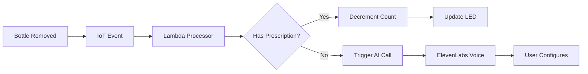

# 💊 PillBuddy

> Smart medication management that actually cares about you

**PillBuddy** is an intelligent IoT medication adherence system that combines ESP32 hardware, mobile app, voice AI, and cloud infrastructure to help users never miss a dose again.

## 🌟 What Makes PillBuddy Special

- **🔔 Smart Reminders**: LED alerts when it's time to take your medication
- **📱 Mobile App**: Track prescriptions, pill counts, and medication history in real-time
- **🗣️ Voice Setup**: AI-powered phone calls guide you through adding new medications
- **🤖 Alexa Integration**: "Alexa, ask PillBuddy about my medications"
- **⚡ Real-Time Sync**: ESP32 device syncs instantly with cloud via AWS IoT Core
- **🎯 Timeout Detection**: Automatic alerts if you forget to return your medication

## 🏗️ Architecture

```
ESP32 Device → AWS IoT Core → Lambda Functions → DynamoDB
                                    ↓
Mobile App ←→ DynamoDB ←→ Alexa Skill
                ↓
        ElevenLabs AI Voice Calls
```

### Tech Stack

**Hardware**

- ESP32 microcontroller with IR sensors
- 3-slot pill bottle holder with LED indicators

**Mobile**

- React Native + Expo
- TypeScript
- AWS IoT MQTT for real-time updates

**Backend**

- AWS CDK for infrastructure as code
- Lambda functions (Python 3.11)
- DynamoDB for data persistence
- AWS IoT Core for device communication
- Alexa Skills Kit for voice control

**AI Integration**

- ElevenLabs Conversational AI
- Twilio for phone call delivery

## 🚀 Quick Start

### Prerequisites

- AWS Account with CDK bootstrapped
- Node.js 18+
- Python 3.9+
- Expo CLI

### Deploy Infrastructure

```bash
cd infrastructure
./deploy.sh
```

### Run Mobile App

```bash
cd mobile-app
npm install
npx expo start
```

### Configure ESP32

1. Flash the ESP32 with Arduino code
2. Connect to AWS IoT Core using device certificates
3. Configure MQTT topics: `pillbuddy/events/{device_id}`

## 📋 Features

### For Users

- ✅ Track multiple medications across 3 slots
- ✅ Visual LED reminders when medication is removed
- ✅ Automatic pill count tracking
- ✅ Refill reminders when running low
- ✅ Voice-guided setup for new medications
- ✅ Alexa voice queries for medication status

### For Developers

- ✅ Serverless architecture with AWS Lambda
- ✅ Real-time IoT event processing
- ✅ Property-based testing for correctness
- ✅ Type-safe TypeScript mobile app
- ✅ Infrastructure as Code with AWS CDK

## 🎯 How It Works

1. **Setup**: Place pill bottles in the 3-slot holder
2. **Detection**: IR sensors detect when bottles are removed/returned
3. **Tracking**: System automatically decrements pill count on removal
4. **Reminders**: LED lights up if bottle isn't returned within 10 minutes
5. **Voice Setup**: Insert a new bottle → receive AI phone call to configure medication details
6. **Monitoring**: Check status anytime via mobile app or Alexa

## 📊 High Level System Flow



## 🔐 Security

- Device authentication via AWS IoT certificates
- Encrypted MQTT communication
- IAM role-based access control
- API key management for third-party services

## 🤝 Contributing

Built with ❤️ at CUHackit 2026

---

**Made possible by**: AWS, ElevenLabs, Twilio, Expo, and lots of coffee ☕
